费用管控 
==========================================================================================================================================
# 项目介绍：
      费用管控项目主要是为中小型企业打造的一款报销办公软件系统，包括PC端和APP。
 ## PC端主要功能：
 
 ## 系统工作原理：
   ### 前置工作：
此软件系统主要是为项目、合同的创建、开票以及各种费用的报销所用。各种功能涉及的最关键的部分就是审批流程。审批流程是自定义的，可以创建流程时选择所需要的功能。
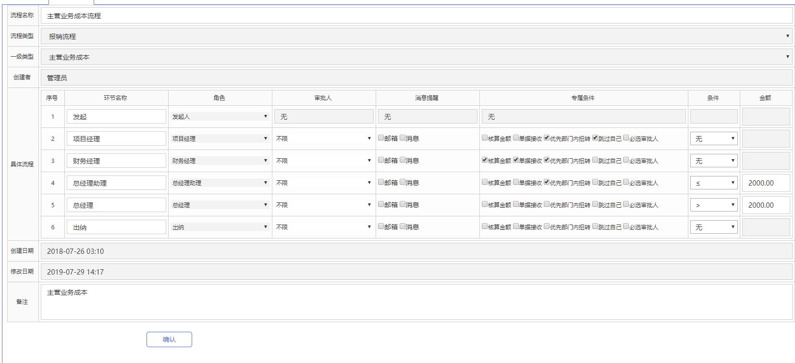
     在报销审批的流程中要使用表单，所以我们也要先创建好表单，在报销、项目、借款、合同的提交中还要使用到编号，所以编号也要先创建好。
#### 表单设计：
  
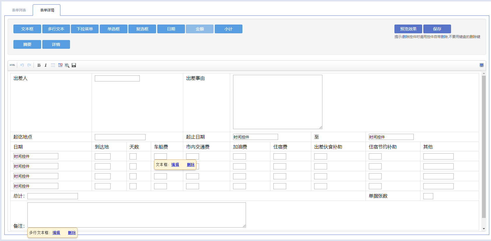 
#### 费用类型设计
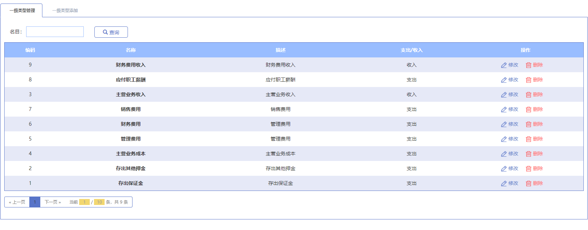  
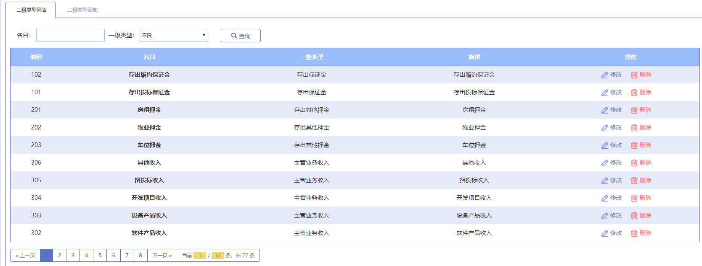 
#### 编号设计
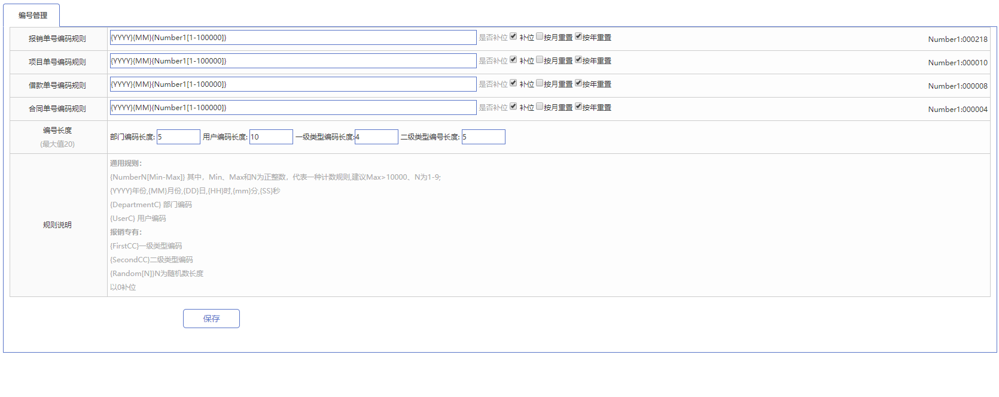 
  ### 开票
  开票模块主要包括开票申请和审批、开票助手、我的发票。
  #### 开票申请审批
  开票主要是为了提交开票信息给财务，让财务对其信息进行审批。
  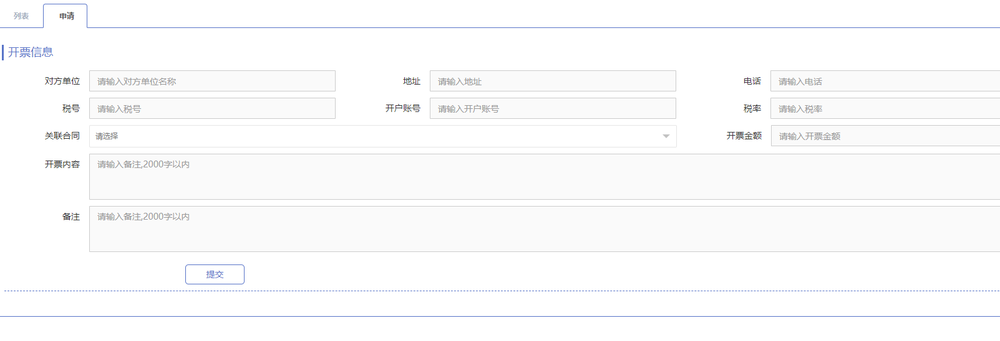  
  #### 开票助手
  开票助手是为了让公司的员工了解公司的报销信息。
  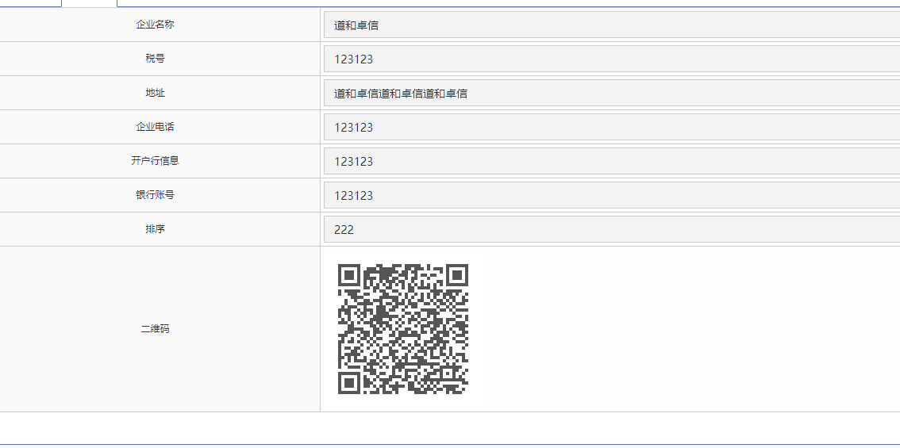
  #### 我的发票
  我的发票是添加发票信息用的，主要是为了以后报销所用。
  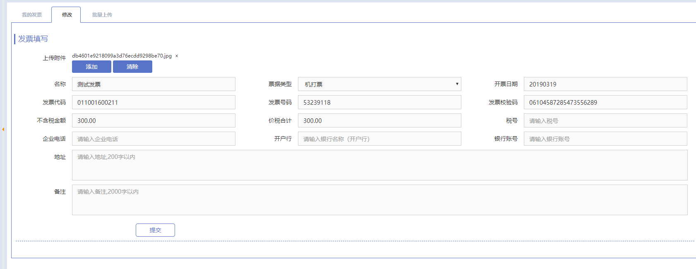
  ### 合同
  #### 合同申请
  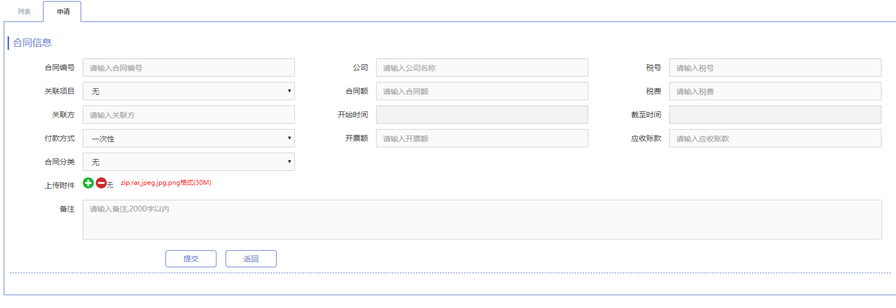
  ### 项目
  #### 立项
   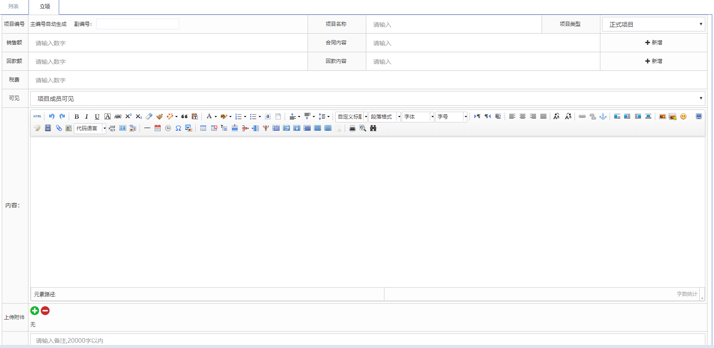
  ### 借款
  #### 借款申请
  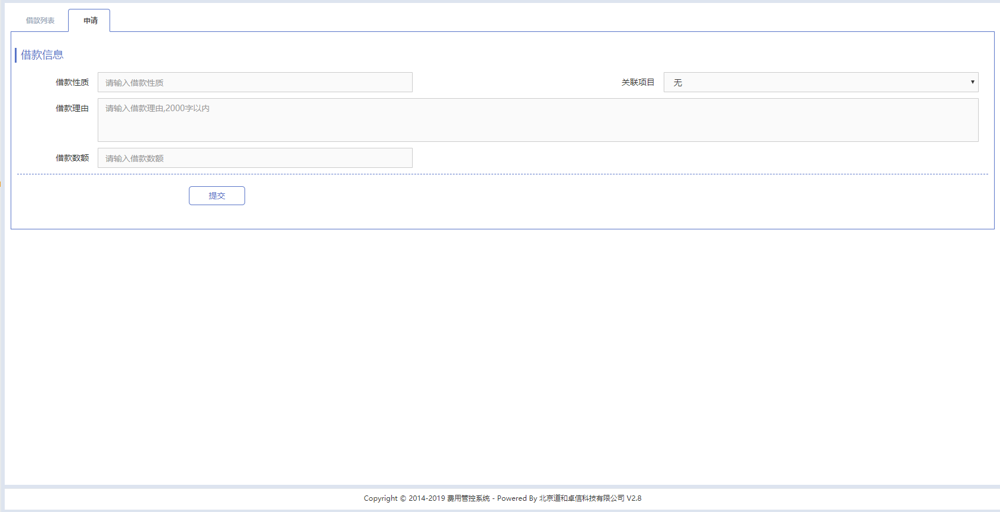
  ### 报销
  #### 报销申请
  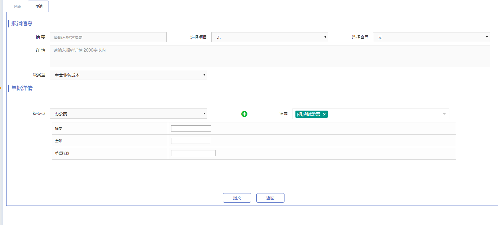
 
   
      
     
